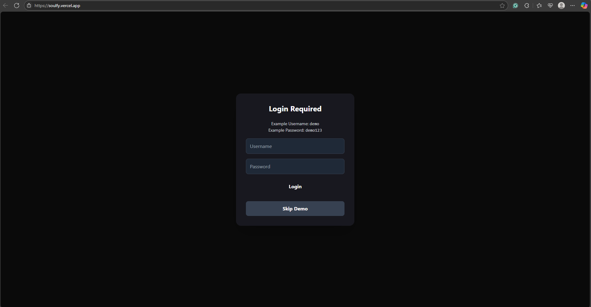
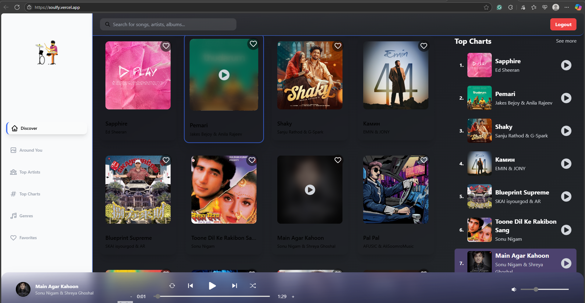

# Soulfy 🎵🔥

Welcome to **Soulfy**, a modern React.js Music Application for smooth streaming, clean UI, and maximum vibes. 
Inspired by Spotify, but with a personal twist.

Crafted by **Krishna**, this project is all about exploring music with elegance, performance, and fun.

---

## Screenshots

### Login Page


### Player & Top Charts


---

## Features

- Discover Page — Your gateway to trending tracks
- Top Charts — See what's popping worldwide
- Top Artists — Explore your favorite music creators
- Music Player — Smooth, animated, and responsive player with play/pause, next/prev, shuffle, repeat, and volume controls
- Redux Integration — Seamless state management for playback control
- API Integration — Real-time music data from ShazamCore API (via local proxy)
- Genre Browsing — Browse and play songs by genre with a beautiful, interactive UI
- Favorites Playlist — Add/remove any song to your personal favorites playlist (stored in your browser)
- Login/Logout & Skip Demo — Simple authentication gate with demo credentials and skip option
- Dark Theme — Modern, slick design with deep gradients for sidebar and navbar
- Mobile Responsive — Perfect vibes on every device
- Custom Sidebar — Unique logo and aesthetic navigation

---

## API & Proxy Setup

- Uses [ShazamCore API](https://rapidapi.com/tipsters/api/shazam-core) via a local Express proxy server to avoid CORS issues.
- The free RapidAPI plan has a monthly quota. If you exceed it, the app will show an error until the quota resets or you upgrade your plan.

---

## Built With
- React.js  
- Tailwind CSS  
- Redux Toolkit & RTK Query  
- ShazamCore API  
- Vite  
- React Icons  
- Express (for proxy server)

---

## Getting Started  

```bash
# Clone the repo
git clone https://github.com/krishnash648/Soundify.git

# Enter the project directory
cd Soundify

# Install the dependencies
npm install

# Start the proxy server (in a separate terminal)
node proxy-server.js

# Start the development server
npm run dev

Open your browser at http://localhost:3000 to hear the music.
```

---

## How to Use
- Browse by Genre: Go to the "Genres" page from the sidebar and explore music by your favorite genres.
- Add to Favorites: Click the heart icon on any song card to add/remove it from your personal favorites playlist.
- View Favorites: Access all your favorited songs from the "Favorites" page in the sidebar.

---

## Contact
- Email: sharmakrishna1605@gmail.com
- GitHub: krishnash648
- Twitter: @ipriyaaa
- Instagram: @priyxhaa

Built with passion and a love for music by Krishna.
